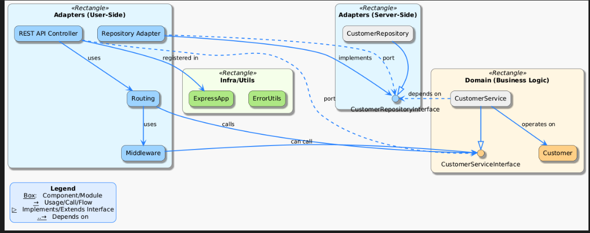

This diagram visually represents the hexagonal architecture of the Customer Operations service, including Adapters (User-Side and Server-Side), Domain (Business Logic), Infra/Utils, and the relationships between components. The legend explains the meaning of each arrow and box style.
